# 🦁 Zoológico Interactivo 🌿

<div align="center">


**Una experiencia inmersiva que te lleva por los ecosistemas más fascinantes del planeta** 🌍


</div>

---

## 🌟 ¿Qué es Zoológico Interactivo?

Una aplicación móvil desarrollada en **Flutter** que transforma el aprendizaje sobre la biodiversidad en una aventura visual interactiva. Navega a través de **3 niveles jerárquicos** llenos de información detallada sobre ecosistemas, hábitats y especies animales.

<div align="center">

### 🏛️ Arquitectura de Navegación

```mermaid
graph TD
    A[🌍 Ecosistemas] --> B[🏞️ Hábitats]
    B --> C[🦁 Animales]
    A --> D[🏜️ Desierto]
    A --> E[🌊 Océano]
    A --> F[🌾 Sabana]
    A --> G[🌲 Bosque Templado]
```



</div>

---

## 🌎 Ecosistemas Disponibles

<table>
<tr>
<td align="center" width="20%">

🌿 **Selva**  
*Biodiversidad tropical*  


</td>
<td align="center" width="20%">

🏜️ **Desierto**  
*Supervivencia extrema*  


</td>
<td align="center" width="20%">

🌊 **Océano**  
*Misterios submarinos*  


</td>
<td align="center" width="20%">

🌾 **Sabana**  
*Grandes migraciones*  


</td>
<td align="center" width="20%">

🌲 **Bosque Templado**  
*Ciclos estacionales*  


</td>
</tr>
</table>

---

## ⚡ Funcionalidades Destacadas

<div align="center">

| 🎨 **Tema Dinámico** | 🔄 **Transiciones** | 📱 **Responsive** | 💾 **Persistencia** |
|:---:|:---:|:---:|:---:|
| Modo claro/oscuro | Animaciones suaves | Multi-dispositivo | SharedPreferences |

</div>

---

## 🎨 Implementación de Temas con SharedPreferences


### 🏗️ Arquitectura de Temas

<div align="center">

```
📱 Usuario interactúa
    ↓
🎛️ ThemeManager (Provider)
    ↓
💾 SharedPreferences
    ↓
🎨 Tema persistente
```

</div>

#### 🔧 Gestor Central de Temas

```dart
class ThemeManager extends ChangeNotifier {
  static const String _themeKey = 'isDarkModeEnabled';
  bool _isDarkMode = false;

  // 🚀 Carga automática al inicializar
  void _loadThemeFromPrefs() async {
    SharedPreferences prefs = await SharedPreferences.getInstance();
    _isDarkMode = prefs.getBool(_themeKey) ?? false;
    notifyListeners();
  }

  // 💾 Guardado inmediato tras cambio
  Future<void> toggleTheme() async {
    _isDarkMode = !_isDarkMode;
    SharedPreferences prefs = await SharedPreferences.getInstance();
    await prefs.setBool(_themeKey, _isDarkMode);
    notifyListeners();
  }
}
```

### 🎨 Definición de Temas

<div align="center">

<table>
<tr>
<th>☀️ Tema Claro</th>
<th>🌙 Tema Oscuro</th>
</tr>
<tr>
<td>

**Colores Primarios**
- 🔵 Azul vibrante `#00C6FF`
- 🟢 Verde vibrante `#00E676`
- ⚪ Fondo blanco puro

**Gradientes**
- 🌤️ Sky blue → Alice blue
- ✨ Optimizado para día

</td>
<td>

**Colores Primarios**
- 🔷 Azul suave `#64B5F6`
- 🟩 Verde suave `#66BB6A`
- ⬛ Negro material

**Gradientes**
- 🌃 Azul oscuro → Negro
- 👁️ Optimizado para noche

</td>
</tr>
</table>

</div>

### 🔄 Implementación 

```dart
Consumer<ThemeManager>(
  builder: (context, themeManager, child) {
    return Container(
      decoration: BoxDecoration(
        gradient: LinearGradient(
          colors: themeManager.adaptiveGradientColors, // 🎨 Colores dinámicos
        ),
      ),
      child: YourWidget(),
    );
  },
)
```

### 🎛️ Interfaz de Control

<div align="center">

| Componente | Ubicación | Funcionalidad |
|:---:|:---:|:---:|
| **Switch Animado** | AppBar superior derecha | Toggle instantáneo |
| **Transición** | 300ms easeInOut | Cambio suave |
| **Auto-guardado** | Inmediato | Sin intervención manual |

</div>

---

## 🚀 Instalación y Configuración

### 📋 Prerrequisitos


- **Android Studio**  
- **SDK de Android**  
- **Dispositivo Android** con depuración USB habilitada o **emulador configurado** 


### 📦 Dependencias

```yaml
dependencies:
  flutter:
    sdk: flutter
  provider: ^6.0.5           # Estado reactivo
  shared_preferences: ^2.2.2  # Persistencia
  google_fonts: ^6.1.0       # Tipografía Poppins
```

### ⚙️ Comandos de Instalación

```bash
# 📥 1. Clonar repositorio
git clone https://github.com/Ana-gon03/Practica02_Aplicacion_movil_basica.git


# 📦 2. Instalar dependencias
flutter pub get

# 🚀 3. Ejecutar aplicación
flutter run
```

---

## 📱 Cómo Usar el Selector de Tema

<div align="center">

### 🎯 Guía Paso a Paso

| Paso | Acción | Resultado |
|:---:|:---:|:---:|
| **1** | Abrir app | Tema claro por defecto |
| **2** | Tocar switch superior | Cambio inmediato |
| **3** | Navegar por niveles | Consistencia visual |
| **4** | Cerrar app completamente | Persistencia garantizada |
| **5** | Reabrir aplicación | Tema guardado activo |

</div>

### 🎨 Indicadores Visuales
<div align="center">
<table>
<tr>
<td align="center">

☀️ **Modo Claro**
- Ícono: Sol brillante
- Colores: Vibrantes y claros
- Uso: Perfecto para el día

</td>
<td align="center">

🌙 **Modo Oscuro**
- Ícono: Luna creciente
- Colores: Suaves y oscuros
- Uso: Ideal para la noche

</td>
</tr>
</table>
</div>
---

## 🏛️ Arquitectura del Proyecto


```
lib/
├── main.dart                 # Punto de entrada + Provider
├── models/                   # Modelos de datos
│   ├── ecosystem.dart
│   ├── habitat.dart
│   └── animal.dart
├── screens/                  # Pantallas principales
│   ├── ecosystem_screen.dart
│   ├── habitat_screen.dart
│   └── animal_screen.dart
├── theme/                    # Sistema de temas
│   ├── theme_manager.dart
│   ├── light_theme.dart
│   └── dark_theme.dart
└── widgets/                  # Componentes reutilizables
├── ecosystem_card_widget.dart
├── animal_modal_widget.dart
├── app_header_widget.dart
├── habitat_grid_card_widget.dart
├── animal_card_widget.dart
└── theme_switch_widget.dart

```


---

## 🎮 Navegación y UX

### 🗺️ Flujo de Usuario

```mermaid
flowchart LR
    A[🌍 Ecosistemas] -->|Tap + Fade| B[🏞️ Hábitats]
    B -->|Slide + Scale| C[🦁 Animales]
    B -->|Bottom Sheet| D[📋 Info Hábitat]
    C -->|Modal Dialog| E[🔍 Detalles Animal]
```

<div align="center">



</div>

### ✨ Transiciones Personalizadas

<table>
<tr>
<td align="center" width="33%">

**🎭 Nivel 1 → 2**  
Fade + Scale  


</td>
<td align="center" width="33%">

**🎬 Nivel 2 → 3**  
Slide + Fade + Scale  


</td>
<td align="center" width="33%">

**🎪 Modales**  
Bottom Sheet / Dialog  


</td>
</tr>
</table>

---

## 🧪 Pruebas de Persistencia

<div align="center">

### ✅ Checklist de Verificación

| Prueba | Procedimiento | Resultado Esperado |
|:---:|:---:|:---:|
| **🔄 Cambio Inmediato** | Switch tema → navegar | Todas las pantallas actualizadas |
| **💾 Persistencia** | Tema oscuro → cerrar app → reabrir | App inicia en tema oscuro |
| **🎯 Consistencia** | Navegar 3 niveles | Tema uniforme en toda la app |

</div>

---

## 🛠️ Tecnologías

<div align="center">

### 🚀 Stack Tecnológico

<table>
<tr>
<td align="center">

**⚙️ Core**
- Flutter 3.16.0
- Dart 3.2.0

</td>
<td align="center">

**📦 Dependencias**
- Provider
- SharedPreferences
- Google Fonts

</td>
<td align="center">

**🛠️ Herramientas**
- Android Studio
- Flutter Inspector
- Dart DevTools

</td>
</tr>
</table>

</div>

---

## Temas

<div align="center">

### ☀️ Tema Claro

| 🌍 Ecosistemas | 🏞️ Hábitats | 🦁 Animales |
|:---:|:---:|:---:|
| *Pantalla principal con gradiente claro* | *Grid 2x2 con modal informativo* | *Lista vertical con detalles* |

### 🌙 Tema Oscuro

| 🌍 Ecosistemas | 🏞️ Hábitats | 🦁 Animales |
|:---:|:---:|:---:|
| *Misma vista con gradiente oscuro* | *Colores suaves y contrastantes* | *Modo nocturno optimizado* |

</div>

---
## 📸 Capturas TEMA OSCURO

## 🌍 Nivel 1 – Ecosistemas

<p align="center">
  
  
  
</p>

## 🏞️ Nivel 2 – Hábitat

<p align="center">
  
  
  
</p>

<p align="center">
  
  
</p>


## 🐆 Nivel 3 – Animal
<p align="center">
  
  
  
</p>

<p align="center">
  
  
</p>


---
## 📸 Capturas TEMA OSCURO

## 🌍 Nivel 1 – Ecosistemas
<p align="center">
  
  
  
</p>


## 🏞️ Nivel 2 – 

<p align="center">
  
  
  
</p>

<p align="center">
  
  
</p>


## 🐆 Nivel 3 – Animal

<p align="center">
  
  
  
</p>


---

## 🌟 ¡Explora la Biodiversidad del Planeta! 🌍

**Zoológico Interactivo** - *Donde la tecnología se encuentra con la naturaleza*

---

*Desarrollado con ❤️ usando Flutter*

</div>
